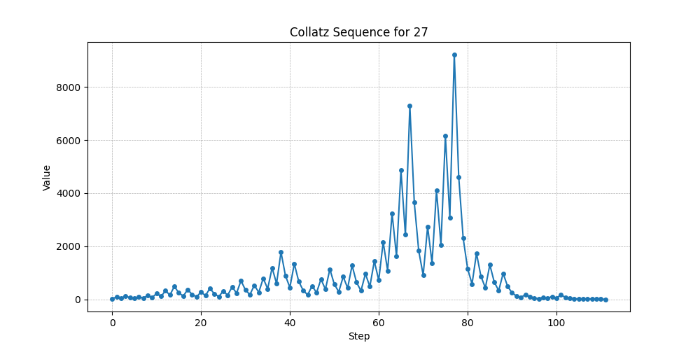

# Collatz Sequence Visualization

## Overview

The Collatz sequence, also known as the 3n + 1 problem, is named after the German mathematician Lothar Collatz, who first introduced it in 1937. This process leads to what is known as the Collatz Conjecture, one of the most intriguing unsolved problems in mathematics. Despite its straightforward formulation, the sequence's complexity and the absence of a general proof for all positive integers have kept mathematicians engaged for decades.  

**The Collatz sequence is defined by the following simple rules:**

- Let $$a_0 = n$$ be the initial positive integer. The subsequent terms of the sequence are defined as follows:

$$
\large
a_{k+1} = \begin{cases}
\frac{a_k}{2} & \text{if } a_k \text{ is even} \\
3a_k + 1 & \text{if } a_k \text{ is odd}
\end{cases}
\large
$$

- The sequence terminates when $$a_k = 1$$ for some $$k > 0$$

Although the sequence theoretically enters the infinite cycle 1→4→2→1 once it reaches 1, the implementation stops at 1, following the convention used in most computational treatments of the Collatz sequence.

Despite its simple rules, the Collatz conjecture remains an unsolved problem in mathematics. The conjecture posits that no matter what positive integer you start with, the sequence will always eventually reach 1. Although no counterexample has been found, a general proof or disproof has yet to be discovered.
