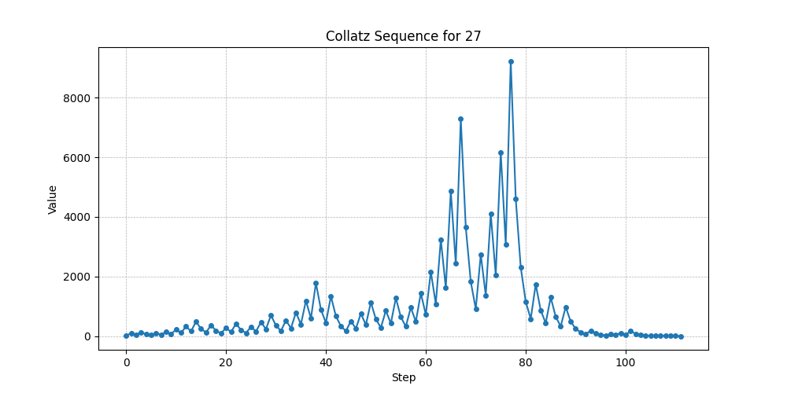

# Collatz Sequence Visualization

## Overview

The Collatz sequence, also known as the 3n + 1 problem, is named after the German mathematician Lothar Collatz, who first introduced it in 1937. Although it is a simple recursive process, the behavior of the sequence remains one of the most intriguing unsolved problems in mathematics. Despite its straightforward formulation, the sequence's complexity and the absence of a general proof for all positive integers have kept mathematicians engaged for decades.  

## The Collatz sequence is a mathematical sequence defined by the following simple rules  

Start with any positive integern.  

If n is even, divide it by 2.  

If n is odd, multiply it by 3 and add 1.  

Repeat the process until n reaches 1.  

Despite its simple rules, the Collatz conjecture remains an unsolved problem in mathematics. The conjecture posits that no matter what positive integer you start with, the sequence will always eventually reach 1. Although no counterexample has been found, a general proof or disproof has yet to be discovered.
